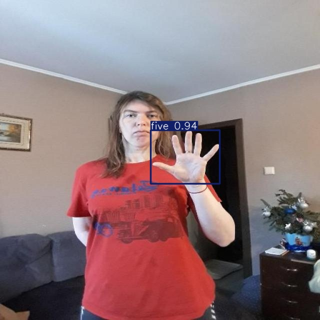

## Notas hand-sign-number-recognition


Descargar Dataset: https://universe.roboflow.com/new-workspace-5ucgu/hand-7hx79

Convertir Dataset
```bash
python3 -m venv venv
source venv/bin/activate
python convert.py
```

Entrenar (Msilicon Mac agregar device=mps)
```bash
yolo train model=yolo11n.pt data=ruta/al/dataset/convertido/data.yaml epochs=3 imgsz=640 
```

Demo
```bash
python camera.py
```

